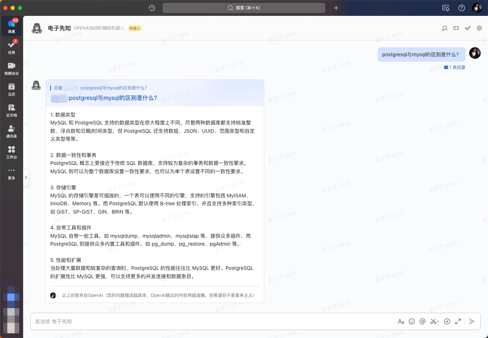
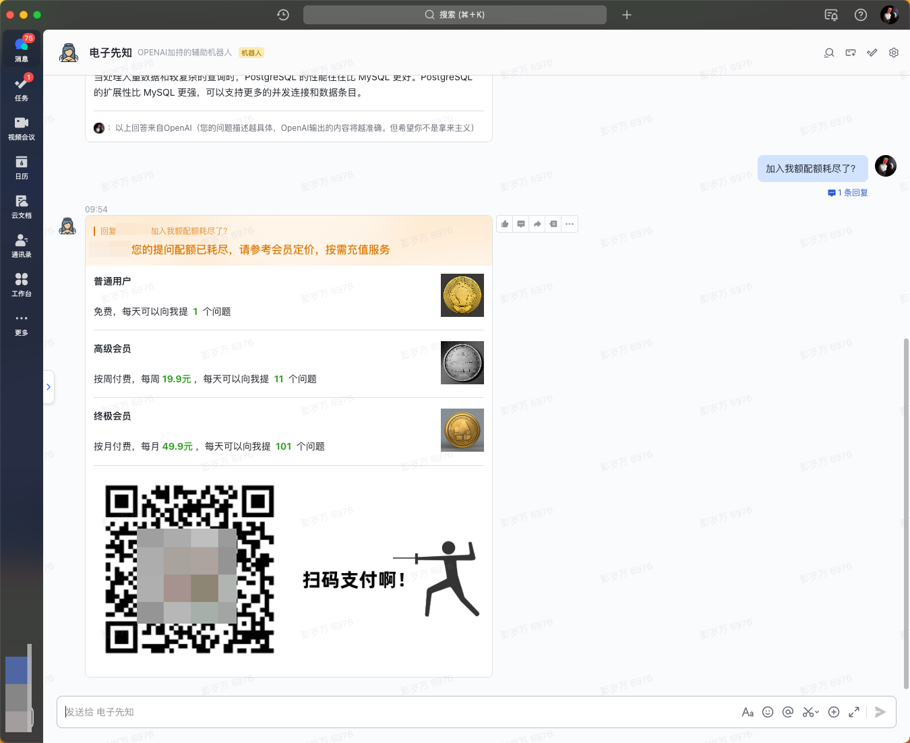
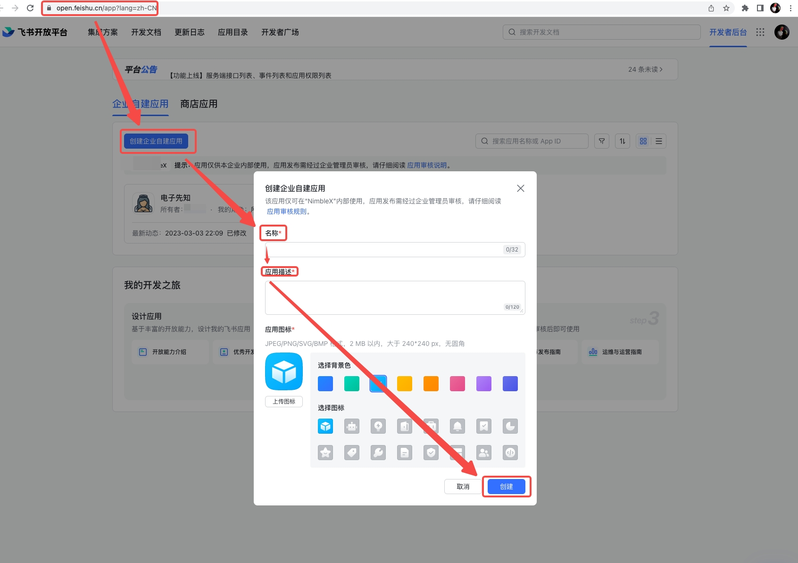
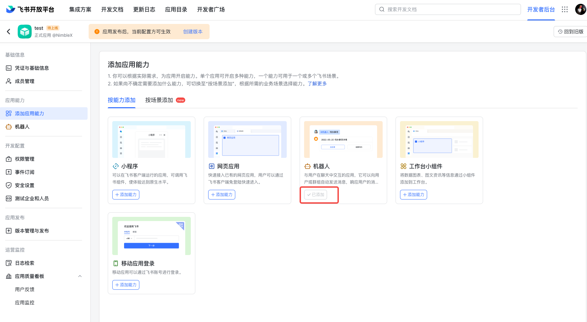
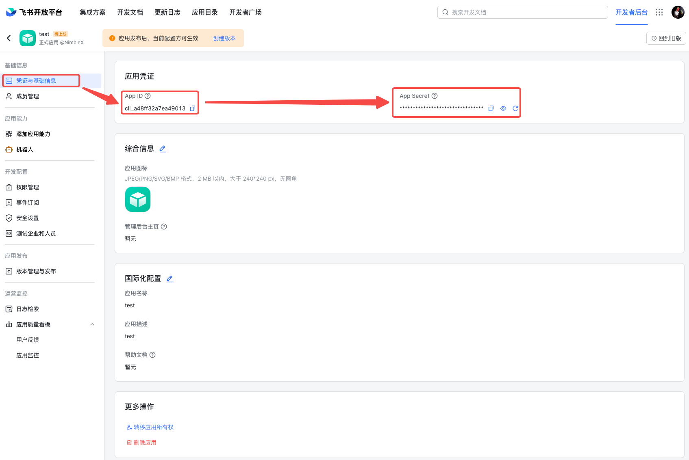
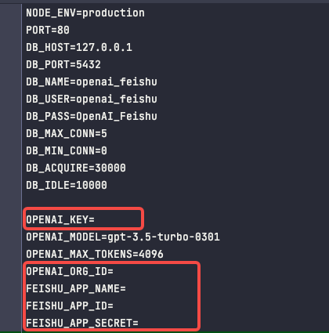
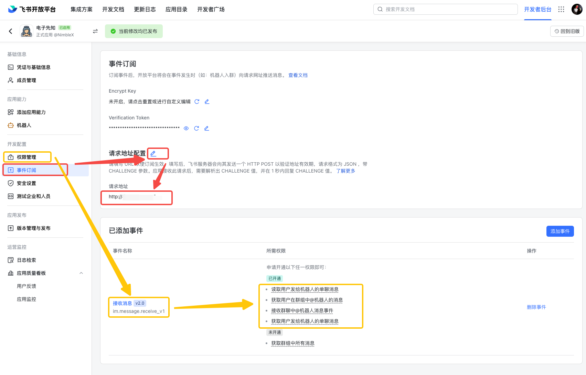
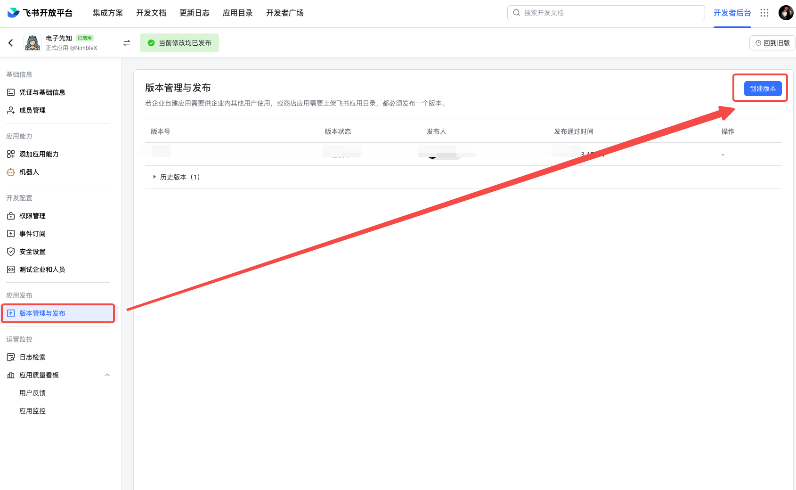

## OpenAI-Feishu-Bot
> 基于OpenAI API服务的飞书机器人。针对回复内容，使用飞书的消息卡片方式进行包装，保证格式更易于阅读。与此同时，数据库中记录了所有用户的问题与openai的回答。

## 演示
* 回复文本消息（支持在单聊中直接提问，支持再群组或群聊中@机器人提问）


* 回复图片消息 (允许用户描述图片需求，由OpenAI生成图片并通过卡片返回)  
**TODO** (计划于3月8日更新)

* 额度充值（可以通过此种方式，要求使用的成员付费购买额度，以实现集资订阅服务。要相信，只有花钱，才有稳定可靠的服务）


## 部署安装方式
* 获取飞书应用的AppID和AppSecret
  * 申请飞书应用
  
  * 开通机器人能力
  
  * 查看AppID和AppSecret
  

* 申请OpenAI API Key
  * 使用VPN，保证IP归属地不在中国大陆或香港即可
  * 利用[短信接码平台](https://sms-activate.org/)，注册[OpenAI](https://chat.openai.com/auth/login)账号
  * 查看OpenAI API Key
  

* 本项目部署到服务器
  * 本地安装一个postgresql，创建一个数据库，并创建一个用户，用于本项目的数据库连接，譬如使用docker-compose完成数据库创建
  ```shell
  # 进入本项目根目录
    cd openai-feishu-bot
  # 创建数据库
    docker-compose -f docker-compose.db.yml up -d
  ```
  * 将前两个步骤中获取到的AppID和AppSecret，以及OpenAI API Key，填写到本项目的配置文件`.env_sample`中  
  
  * 将`.env_sample`重命名为`.env` 
  ```shell
    mv .env_sample .env
  ```
  * 启动本项目
  ```shell
    npm install -g pm2
    npm i
    pm2 start pm2.config.json
  ```
  * 服务启动完成后，需要在飞书应用中，配置请求地址及权限，才能正常使用
  
  * 发布应用
  

## 欢迎交流


